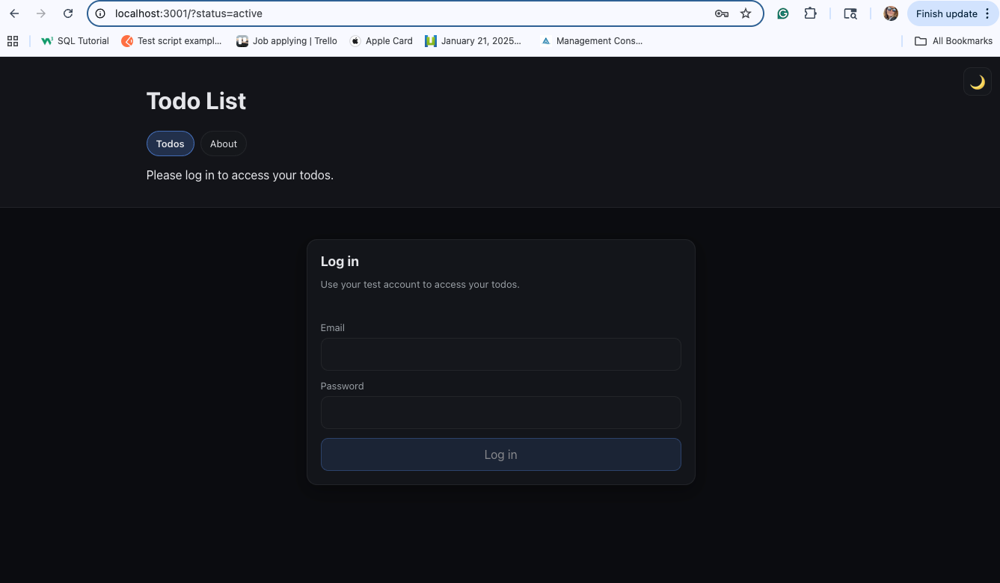
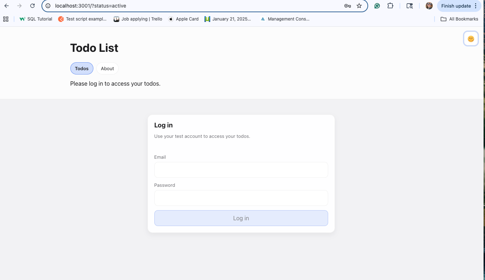
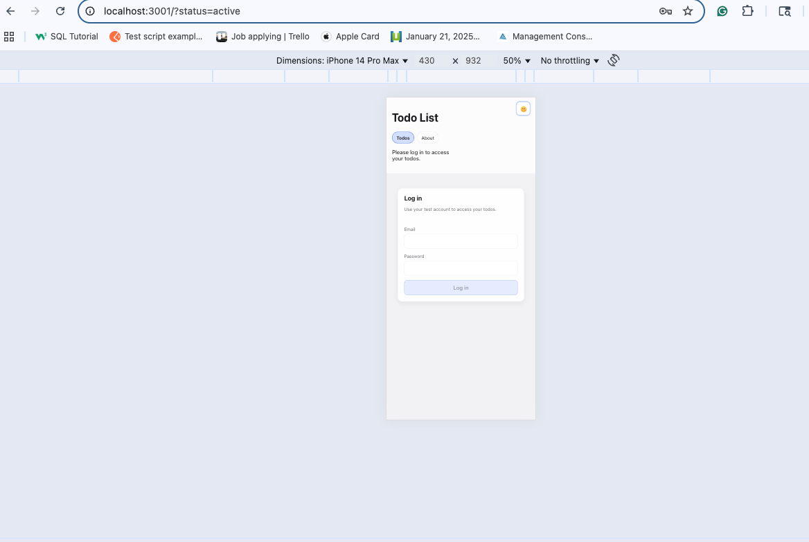
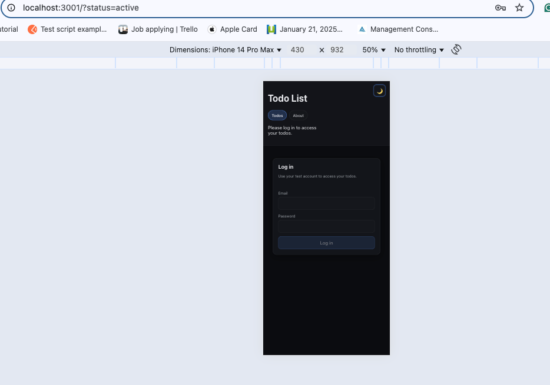

# Todo List — React + Vite

A production-ready Todo application built with React and Vite demonstrating modern front-end engineering practices including authentication, secure input handling, CRUD operations, accessibility, and responsive UI design.

This project is designed for portfolio presentation and is deployed live using Render static hosting.

## Live Demo

Live Application:
https://your-render-url.onrender.com

GitHub Repository:
https://github.com/TetianaPav/todo-list

## Features

Create, update, complete, and delete todos (Full CRUD)

Filter todos (All / Active / Completed)

Secure authentication with CSRF token

Client-side validation with max-length enforcement

Input sanitization using DOMPurify (XSS protection)

Loading, error, and empty states

Accessible keyboard navigation

Responsive layout (mobile / tablet / desktop)

Light/Dark theme support

Clean component-based architecture

## Technologies Used

React

Vite

JavaScript (ES6+)

CSS Modules

DOMPurify (input sanitization)

ESLint

Render (static hosting)

## Screenshots

### Desktop View

### Mobile View

## Getting Started

### Prerequisites

- Node.js
- npm

### Installation

npm install

### Run Development Server

npm run dev

## Available Scripts

| Script            | Description                      |
| ----------------- | -------------------------------- |
| `npm run dev`     | Start development server         |
| `npm run build`   | Create production build          |
| `npm run preview` | Preview production build locally |
| `npm run lint`    | Run ESLint                       |

## Security & Validation

The application implements front-end security best practices:

Input validation prevents empty or invalid submissions

DOMPurify sanitizes all user input to prevent XSS

Maximum input length enforced

Control and invisible Unicode characters blocked

Safe error messages without exposing system details

## Styling & Design Approach

The UI uses CSS Modules for scoped, maintainable styling and consistent theming.

Design highlights:

Clean card-based layout

Consistent spacing and typography hierarchy

Accessible focus indicators

Hover / active / disabled interaction states

Theme-aware color system

Fully responsive layout across devices

## Accessibility

Keyboard navigation supported

Visible focus indicators

Accessible labels and ARIA attributes

Touch-friendly controls (min 44px)

Readable color contrast

Deployment (Render)

This app is deployed using Render Static Site Hosting.

Build settings:

Build Command: npm run build

Publish Directory: dist

Branch: main

Important (React Router)

A rewrite rule is required so client-side routing works after refresh:

Source: /\*
Destination: /index.html
Action: Rewrite

## Future Improvements

Drag-and-drop todo reordering

Backend persistence for todos

Unit tests (React Testing Library)

Progressive Web App (PWA)

Animation & micro-interactions

Token persistence (localStorage)

## License

MIT License

## Contact

GitHub: https://github.com/TetianaPav
Portfolio: [https://your-portfolio-link.com](https://your-portfolio-link.com)
